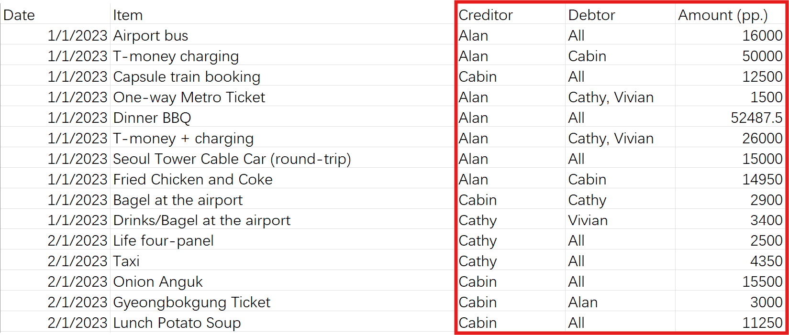

# Easy Split
EasySplit (`splitbill`) is a tool for splitting bill in a group trip.

During a trip, bills are often paid collectively by one person in the group and then split among all members (or some of the members) later on. These bills can accumulate and become difficult to manually track and calculate, especially the one paying (and being paid for) could be different every time. It could be even worse when multiple currency involved in the transactions. On the other hand, settling the bills immediately after each transaction can also be cumbersome.

The EasySplit provides a command line interface `splitbill`, and supports being imported to python scripts. It takes the payment records from the a data sheet (`.xlsx`, `.csv` or `.tsv`), and **generates the simplest scheme for paying off everyone's bills with the least number of transactions**. 

With EasySplit, anyone in the group can contribute to paying the bill, eliminating the need to split the bill immediately as long as the payment is accurately recorded in a sheet. This feature is particularly beneficial during group trips to locations with different local currencies, as any group member can assist in paying, and the repayment can be done in the home currency.

## Installation
- `Python >= 3.10`
- All packages listed in `requirements.txt` (will be automatically installed)

```
git clone https://github.com/cabinz/easy-split
cd ./easy-split
pip install .
```

## Usage

The recording sheet table could be like [sample files](samples/).


Actually, the splitter only requires four columns in the red box, the rest of the content (such as date, item names) are only for the convenience of checking the records: 
- `Creditor` (person who paid the bill)
- `Debtor` (ppl. who owe money)
- `Amount` (the total amount of money the creditor paid)
- `Currency` (the transaction currency)

In command line, run the EasySplit with
```shell
splitbill \
    --file "samples/sample_data.xlsx" \  
    --standard_currency "HKD" \
    --exchange_rate "KRW/HKD=0.0057715"
# args: 
# --file: data sheet
# --standard_currency: result currency
# --exchange_rate: used to convert KRW to standard currency (support specifying multiple exchange rates)
```

The results will be like:
```shell
...
Members: Cathy, Alan, Vivian, Cabin
====================
Creditors:
        Alan: HKD1067.90
Debtors
        Cathy: HKD652.40
        Vivian: HKD411.34
        Cabin: HKD4.16
====================
Simplest bill splitting scheme:
  Creditor  Debtor  Amount (HKD)
0     Alan   Cathy        652.40
1     Alan  Vivian        411.34
2     Alan   Cabin          4.16
...
```

--- 

There are more parameters support customization in the command-line arguments:
```shell
options:
  -h, --help            show this help message and exit
  --file FILE           Path to the data file.
  --col_creditor COL_CREDITOR
                        Column name for creditors in the sheet. Default as "Creditor".
  --col_debtor COL_DEBTOR
                        Column name for debtors in the sheet. Default as "Debtor".
  --col_tot_amount COL_TOT_AMOUNT
                        Column name for total lending amount (from the creditor) in the sheet. Default as 'Amount'
  --col_currency COL_CURRENCY
                        Column name for transation currency. Default as 'Currency'
  --separator SEPARATOR
                        Separator for splitting names in a cell. Default as comma ','.
  --all_selector ALL_SELECTOR
                        String specifying all members memtioned in the data. Default as 'all'.
  --standard_currency STANDARD_CURRENCY
                        The currency for settlement (ie., to be displayed in results). eg., "HKD".
  --exchange_rate EXCHANGE_RATE
                        Exchange rate. BASE/QUOTE=x means 1 BASE is converted to x QUOTE. eg., USD/HKD=7.8
  --result_dump_path RESULT_DUMP_PATH
                        File path to dump the output sheet. eg. "path/to/out.csv".
  --details_dump_path DETAILS_DUMP_PATH
                        File path to dump the detailed preprocessed record sheet. eg. "path/to/details.csv".
```
