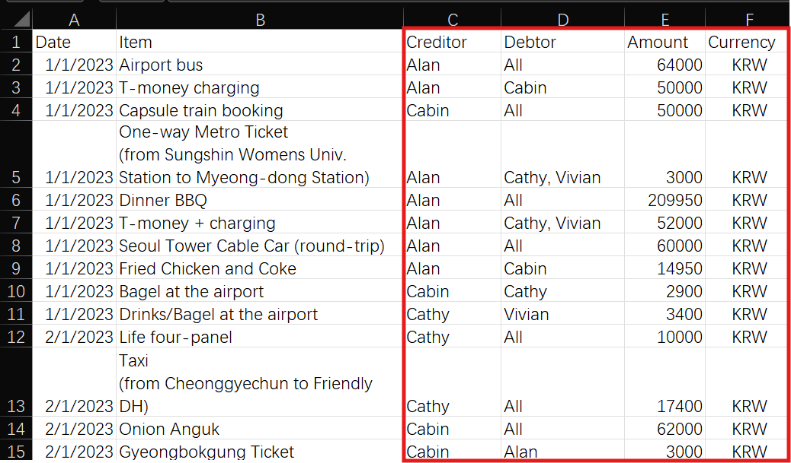

# Easy Split

EasySplit (`splitbill`) is a Python-based bill splitting tool designed for group trips and shared expenses. It processes payment records from spreadsheets and generates an optimized repayment scheme with the minimum number of transactions.

## Key Features

- **Smart Column Detection**: Automatically detects column names (Payer/Payee or Creditor/Debtor)
- **Multi-Currency Support**: Handles multiple currencies with exchange rate conversion
- **Transaction Optimization**: Generates the simplest repayment scheme with minimal transactions
- **Flexible Input**: Supports Excel (.xlsx), CSV, and TSV files
- **Data Validation**: Built-in validation with helpful error messages
- **Beautiful Output**: Formatted tables for easy reading
- **Export Results**: Option to export results and detailed records to CSV

## Why EasySplit?

During group trips or shared activities, bills are often paid by different members and split later. Manual tracking becomes complex when:
- Different people pay at different times
- Multiple currencies are involved
- Bills need to be split among specific subsets of the group

EasySplit solves this by:
1. Recording all transactions in a simple spreadsheet
2. Automatically calculating net balances
3. Finding the optimal settlement with minimum transactions
4. Converting all amounts to your preferred currency

## Installation

### Requirements
- Python >= 3.10
- Dependencies: numpy, pandas, openpyxl (automatically installed)

### Quick Install

Using pip:
```bash
git clone https://github.com/cabinz/easy-split
cd easy-split
pip install .
```

Using uv (recommended for development):
```bash
git clone https://github.com/cabinz/easy-split
cd easy-split
uv pip install -e .
```

Using make:
```bash
git clone https://github.com/cabinz/easy-split
cd easy-split
make install         # For users
make install-dev     # For developers (sets up venv)
```

## Quick Start

### 1. Prepare Your Data

Create a spreadsheet with transaction records. See [sample files](samples/) for examples.



Required columns (auto-detected):
- **Creditor/Payer**: Person who paid the bill
- **Debtor/Payee**: People who owe money (use "all" or "*" for everyone)
- **Amount/Total**: Total amount paid
- **Currency**: Transaction currency (optional if single currency)

### 2. Run the Command

Basic usage with auto-detection:
```bash
splitbill \
    --file "samples/sample_data.xlsx" \
    --standard_currency "HKD" \
    --exchange_rate "KRW/HKD=0.0057715"
```

With custom column names:
```bash
splitbill \
    --file "data.csv" \
    --col_creditor "From" \
    --col_debtor "To" \
    --col_tot_amount "Value" \
    --standard_currency "USD" \
    --exchange_rate "EUR/USD=1.08"
```

Validate data without processing:
```bash
splitbill \
    --file "data.xlsx" \
    --standard_currency "USD" \
    --validate-only
```

### 3. View Results

The output shows the optimized repayment scheme:
```
Members: Vivian, Alan, Cathy, Cabin
====================
Creditors:
        Alan: HKD1067.90
Debtors:
        Vivian: HKD411.34
        Cathy: HKD652.40
        Cabin: HKD4.16
====================
Simplest bill splitting scheme: (with 3 transactions)
╔════╦══════════╦═════╦════════╦══════════════╗
║ #  ║ Creditor ║     ║ Debtor ║ Amount (HKD) ║
╠════╬══════════╬═════╬════════╬══════════════╣
║ 1  ║   Alan   ║ <-- ║ Vivian ║        411.34║
║ 2  ║   Alan   ║ <-- ║ Cathy  ║        652.40║
║ 3  ║   Alan   ║ <-- ║ Cabin  ║          4.16║
╚════╩══════════╩═════╩════════╩══════════════╝
```

## Advanced Usage

### Command-Line Options

```bash
splitbill [OPTIONS]

Required:
  --file FILE                   Path to the data file (.xlsx, .csv, .tsv)
  --standard_currency CURRENCY  Currency for settlement (e.g., "USD", "EUR")

Optional:
  --exchange_rate RATE          Exchange rate: BASE/QUOTE=x (e.g., "EUR/USD=1.08")
                                Can specify multiple rates
  
Column Names (auto-detected if not specified):
  --col_creditor NAME           Column for payer (default: auto-detect)
  --col_debtor NAME             Column for payee (default: auto-detect)  
  --col_tot_amount NAME         Column for amount (default: auto-detect)
  --col_currency NAME           Column for currency (default: auto-detect)
  
Data Processing:
  --separator SEP               Separator for multiple names (default: ",")
  --all_selector SELECTOR       String for "all members" (default: "all")
  --validate-only              Only validate data without processing
  
Output:
  --result_dump_path PATH       Export results to CSV file
  --details_dump_path PATH      Export detailed records to CSV file
```

### Examples

**Multiple exchange rates:**
```bash
splitbill \
    --file "trip_expenses.xlsx" \
    --standard_currency "USD" \
    --exchange_rate "EUR/USD=1.08" \
    --exchange_rate "GBP/USD=1.27" \
    --exchange_rate "JPY/USD=0.0067"
```

**Export results:**
```bash
splitbill \
    --file "expenses.csv" \
    --standard_currency "EUR" \
    --result_dump_path "settlement.csv" \
    --details_dump_path "all_transactions.csv"
```

**Custom separators and selectors:**
```bash
splitbill \
    --file "data.xlsx" \
    --standard_currency "USD" \
    --separator ";" \
    --all_selector "everyone"
```

## Data Format

### Input Spreadsheet Structure

Your spreadsheet should contain these columns (names are flexible and auto-detected):

| Date | Item | Payer | Payee | Amount | Currency |
|------|------|-------|-------|--------|----------|
| 2024-01-15 | Lunch | Alice | all | 120.50 | USD |
| 2024-01-15 | Taxi | Bob | Alice, Charlie | 45.00 | USD |
| 2024-01-16 | Hotel | Charlie | * | 580.00 | EUR |

**Column Details:**
- **Payer/Creditor**: Who paid for the expense
- **Payee/Debtor**: Who should pay (comma-separated names or "all"/"*")
- **Amount**: Total amount paid
- **Currency**: Optional if using single currency
- **Other columns**: Kept for reference but not processed

### Supported Column Aliases

The tool automatically detects these column name variations:
- Creditor: "Creditor", "Payer", "From", "Paid By"
- Debtor: "Debtor", "Payee", "To", "Split With"
- Amount: "Amount", "Total", "Value", "Cost"
- Currency: "Currency", "Curr", "CCY"

## Development

### Running Tests
```bash
# All tests
uv run pytest

# Specific test
uv run pytest tests/test_auto_detect.py -v

# With coverage
uv run pytest --cov=easysplit
```

### Project Structure
```
easy-split/
├── src/easysplit/
│   ├── __main__.py       # CLI entry point
│   ├── loader.py         # Data loading and preprocessing
│   ├── graph.py          # Graph algorithms for optimization
│   ├── exr.py            # Exchange rate handling
│   ├── validator.py      # Data validation
│   ├── formatter.py      # Output formatting
│   └── config.py         # Configuration and defaults
├── tests/                # Unit and integration tests
├── samples/              # Sample data files
└── Makefile             # Build automation
```

## Contributing

Contributions are welcome! Please feel free to submit pull requests or open issues.
